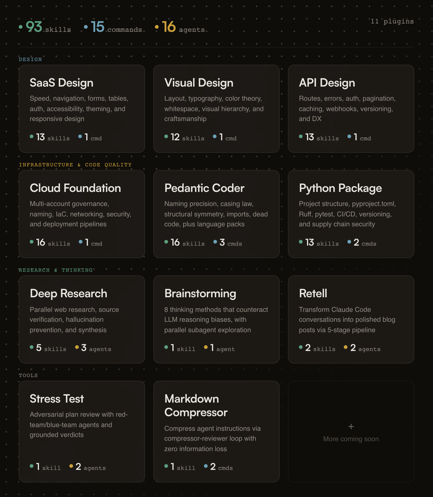

[](https://github.com/oborchers/fractional-cto/blob/main/LICENSE)
[](https://github.com/oborchers/fractional-cto)

# fractional-cto: The AI CTO Co-Pilot for SaaS Engineering

> 93 skills, 15 commands, and 16 agents across 11 plugins. Opinionated, research-backed Claude Code plugins for building SaaS products that ship.



Designed for Claude Code and Cowork. Skills compatible with other AI assistants.

## Start Here

Building a form? Skills activate automatically.
Need an API review? `/api-review`
Auditing code quality? `/pedantic-review`
Researching a topic? `/research "your question"`
Stress-testing a plan? `/stress-test path/to/plan.md`
Compressing your CLAUDE.md? `/compress path/to/file.md`

If this project helps you, star the repo.

## Why fractional-cto?

Generic AI gives you suggestions. fractional-cto gives you standards.

Each skill encodes a proven engineering principle (naming precision, API design patterns, cloud governance) and enforces it the moment Claude detects relevant work. You get the rigor of Stripe's API design, Nielsen Norman's usability research, and production cloud architecture baked into every session. No bookshelf required.

The skills are deliberately opinionated. They don't present five options and ask you to choose. They tell you what to do, cite why, and show you the code. If you disagree, edit the skill. It's just markdown.

## How It Works

Every plugin activates the moment your Claude session starts. A session hook fires, reads the plugin's skill index, and injects it into context. From that point on, Claude *knows* what principles exist and when to apply them.


Each plugin carries review checklists, good/bad pattern comparisons, working code examples, and a dedicated reviewer agent for deeper audits.

## Installation

### Claude Code / Cowork

```bash
# Step 1: Add the marketplace
/plugin marketplace add oborchers/fractional-cto

# Step 2: Install individual plugins
/plugin install saas-design-principles@fractional-cto
/plugin install visual-design-principles@fractional-cto
/plugin install api-design-principles@fractional-cto
/plugin install cloud-foundation-principles@fractional-cto
/plugin install pedantic-coder@fractional-cto
/plugin install python-package@fractional-cto
/plugin install deep-research@fractional-cto
/plugin install structured-brainstorming@fractional-cto
/plugin install retell@fractional-cto
/plugin install stress-test@fractional-cto
/plugin install markdown-compressor@fractional-cto
```

### Other AI assistants (skills only)

The `skills/*/SKILL.md` files follow the universal skill format and work with any tool that reads it. Commands and agents are Claude-specific.

| Tool | How to use | What works |
|------|-----------|------------|
| **Gemini CLI** | Copy skill folders to `.gemini/skills/` | Skills only |
| **OpenCode** | Copy skill folders to `.opencode/skills/` | Skills only |
| **Cursor** | Copy skill folders to `.cursor/skills/` | Skills only |
| **Codex CLI** | Copy skill folders to `.codex/skills/` | Skills only |
| **Kiro** | Copy skill folders to `.kiro/skills/` | Skills only |

```bash
# Example: copy all skills for Gemini CLI (project-level)
for plugin in */; do
  [ -d "$plugin/skills" ] && cp -r "$plugin/skills/"* .gemini/skills/ 2>/dev/null
done
```

### Local Development

```bash
claude --plugin-dir /path/to/fractional-cto/<plugin-name>
```

---

## Available Plugins

<details>
<summary><strong>1. saas-design-principles</strong> -- Speed, navigation, forms, tables, auth, accessibility (13 skills, 1 command, 1 agent)</summary>

Research-backed SaaS design principles drawn from Linear, Stripe, Shopify Polaris, and Nielsen Norman Group research.

**Skills (13):**

- `speed-is-the-feature` -- Optimistic UI, skeleton screens, performance budgets, code splitting
- `saas-navigation` -- Sidebar nav, Cmd+K command palette, breadcrumbs, org switching
- `progressive-disclosure` -- Onboarding, empty states, checklists, signup optimization
- `form-design` -- Inline validation, auto-save vs explicit save, error messages
- `notification-hierarchy` -- Toasts, banners, modals, inline messages, alert fatigue
- `error-handling` -- Validation, 403s, session expiry, offline, conflicts
- `data-tables` -- Pagination, alignment, bulk actions, column defaults
- `permissions-and-settings` -- RBAC, invitations, account vs workspace settings
- `authentication` -- Magic links, MFA, OTP, session management, GDPR
- `accessibility` -- WCAG 2.2 AA, keyboard nav, focus management, SPA a11y
- `design-tokens` -- Three-tier tokens, dark mode, CSS custom properties
- `responsive-design` -- Breakpoints, table-to-card, touch targets, mobile nav
- `using-saas-principles` -- Meta-skill: index of all principle skills

**Commands:** `/saas-review` -- Review code against all SaaS design principles

**Agents:** `saas-design-reviewer` -- Comprehensive audit with severity-rated findings

**Examples:**

- `I'm building a form for user onboarding. Review my component against the SaaS design principles.`
- `Our notification system is overwhelming users. Help me apply the notification hierarchy principle.`
- `Build a data table with pagination and bulk actions following SaaS table best practices.`

</details>

<details>
<summary><strong>2. visual-design-principles</strong> -- Layout, typography, color, whitespace, accessibility (12 skills, 1 command, 1 agent)</summary>

Visual design principles grounded in VisAWI, Gestalt psychology, and empirical aesthetics research.

**Skills (12):**

- `layout-spatial-structure` -- 12-column grid, 8px spacing, CSS Grid/Flexbox, Gestalt proximity, F/Z-patterns
- `typography` -- Modular type scales, font pairing, line height/length, responsive type
- `color-theory-application` -- HSL model, 60-30-10 rule, shade scales, WCAG contrast, dark mode
- `whitespace-density` -- Spacing systems, density spectrum, separation techniques, vertical rhythm
- `visual-hierarchy` -- 3 levers (size/weight/color), 3-tier architecture, CTA design
- `consistency-design-systems` -- Design tokens (primitive/semantic/component), atomic design, governance
- `craftsmanship-polish` -- Pixel alignment, shadows, border-radius, micro-interactions, CLS
- `visual-interest-expression` -- Brand personality, illustrations, motion design, layout variety
- `responsive-design` -- Mobile-first, breakpoints, fluid grids, container queries, touch targets
- `accessibility-inclusive-design` -- WCAG 2.2 AA, contrast ratios, keyboard nav, screen readers
- `design-evaluation-scoring` -- 8-dimension scoring framework, anti-pattern detection
- `using-visual-design-principles` -- Meta-skill: index with 25 quick-reference rules

**Commands:** `/design-review` -- Review visual artifacts with 8-dimension scoring (total out of 40)

**Agents:** `visual-design-reviewer` -- Per-dimension 1-5 scoring with severity-classified findings

**Examples:**

- `Score this landing page against the 8-dimension framework. What's the weakest dimension?`
- `Apply the color theory principle to improve the 60-30-10 distribution in my dashboard.`
- `Review this component for accessibility. Check contrast ratios and keyboard nav.`

</details>

<details>
<summary><strong>3. api-design-principles</strong> -- Routes, errors, auth, caching, webhooks, versioning (13 skills, 1 command, 1 agent)</summary>

API design principles drawn from Stripe, GitHub, Twilio, Google, OWASP, and industry RFCs.

**Skills (13):**

- `routes-and-naming` -- Plural nouns, nesting depth, snake_case, query vs path params
- `http-methods` -- GET/POST/PUT/PATCH/DELETE semantics, idempotency, CRUD patterns
- `prefixed-ids` -- Stripe-style prefixed IDs, ULID/KSUID, validation, prefix registries
- `errors-and-status-codes` -- HTTP status codes, RFC 9457, error envelopes, per-field validation
- `response-design-and-pagination` -- Envelopes, cursor pagination, expand/embed, list metadata
- `auth-and-api-keys` -- Prefixed API keys, OAuth 2.0, JWT, key rotation, 401 vs 403
- `rate-limiting-and-security` -- Sliding window, token bucket, OWASP Top 10, CORS
- `versioning-and-evolution` -- URL versioning, additive evolution, sunset headers
- `caching-and-performance` -- Cache-Control, ETags, CDN, compression, circuit breakers
- `webhooks-and-events` -- HMAC-SHA256 signing, retries, event naming, deduplication
- `documentation-and-dx` -- Three-panel docs, time-to-first-call, SDKs, contract testing
- `advanced-patterns` -- Bulk/batch, REST vs GraphQL vs gRPC, SSE/WebSockets
- `using-api-principles` -- Meta-skill: index of all principle skills

**Commands:** `/api-review` -- Review API code against all 12 design principles

**Agents:** `api-design-reviewer` -- Comprehensive audit with severity-rated findings

**Examples:**

- `Review my error responses. Are they compliant with RFC 9457?`
- `Design a REST endpoint for user auth following API key best practices.`
- `I need to version my API without breaking clients. Guide me through additive evolution.`

</details>

<details>
<summary><strong>4. cloud-foundation-principles</strong> -- Multi-account governance, IaC, networking, security (16 skills, 1 command, 1 agent)</summary>

Cloud infrastructure principles distilled from production experience across multiple cloud migrations. Cloud-agnostic with provider-specific translation tables.

**Skills (16):**

- `multi-account-from-day-one` -- Account structure, environment isolation, landing zones
- `naming-and-labeling-as-code` -- Labels module, naming conventions, cost centers, tag enforcement
- `architecture-decision-records` -- Numbered ADRs, exemption documentation, immutable history
- `repository-and-state-strategy` -- Multi-repo, numbered layers, state-per-layer, blast radius
- `terraform-module-patterns` -- Wrapping community modules, smart defaults, version pinning
- `network-architecture` -- VPC/VNet design, subnet tiers, API gateways, DNS, private connectivity
- `zero-static-credentials` -- SSO for humans, OIDC for CI/CD, session-based instance access
- `security-monitoring-from-day-one` -- Centralized threat detection, compliance scanning
- `secrets-and-configuration-management` -- Credential rotation, config values, secret hierarchy
- `managed-services-over-self-hosted` -- Managed vs self-hosted, container orchestration, databases
- `service-owned-infrastructure` -- Service-owned Terraform, shared modules, no platform bottleneck
- `container-image-tagging` -- Git SHA traceability, registry lifecycle policies, no "latest"
- `tag-based-production-deploys` -- Git tag releases, manual approval gates, pipeline stages
- `unified-cicd-platform` -- Platform consolidation, OIDC auth, eliminating multi-provider burden
- `operational-hygiene` -- Resource cleanup, cost attribution, monitoring, drift detection
- `using-cloud-foundation-principles` -- Meta-skill: index of all principle skills

**Commands:** `/cloud-foundation-review` -- Review infrastructure code against all 15 principles

**Agents:** `cloud-foundation-reviewer` -- Comprehensive infra audit with severity-rated findings

**Examples:**

- `Architect a multi-account AWS setup from day one. How do I structure landing zones?`
- `Review my Terraform modules. Do they follow proper guardrails and smart defaults?`
- `Guide me through migrating from passwords to OIDC for CI/CD.`

</details>

<details>
<summary><strong>5. pedantic-coder</strong> -- Naming, casing, symmetry, imports, dead code, language packs (16 skills, 3 commands, 1 agent)</summary>

Zero-tolerance code pedantry. The obsessive details that separate clean code from correct code.

**Skills (16):**

- `naming-precision` -- Every name is a contract; no generic names like "data" or "temp"
- `casing-law` -- One convention, zero exceptions; enforce consistency across files
- `abbreviation-policy` -- Spell it out or document it; consistent abbreviation conventions
- `boolean-naming` -- is/has/can/should prefix; always positive; no exceptions
- `import-discipline` -- Grouped, sorted, separated; one blank line between groups
- `declaration-order` -- Constants, types, classes, functions in predictable order
- `symmetry` -- Parallel things look parallel; create/update/delete have identical structure
- `one-pattern-one-way` -- One problem, one pattern enforced everywhere
- `magic-value-elimination` -- Every literal has a name; named constants required
- `dead-code-intolerance` -- Delete commented-out code, unused imports, TODO comments
- `visual-rhythm` -- Blank lines separate ideas; consistent spacing; code is prose
- `guidelines-compliance` -- Scans CLAUDE.md files, builds inheritance chain, checks compliance
- `python-pedantry` -- `str | None` not Optional, Pydantic, StrEnum, exception chaining
- `typescript-pedantry` -- strict tsconfig, discriminated unions, Zod schemas, barrel exports
- `go-pedantry` -- error wrapping with %w, interface design, package naming, golangci-lint
- `using-pedantic-principles` -- Meta-skill: index of all principle skills

**Commands:**

- `/pedantic-review` -- Review current code with severity-rated findings
- `/pedantic-audit` -- Full repository audit: discovers structure, samples files, finds convention conflicts
- `/guidelines-review` -- Scan CLAUDE.md files and check code compliance against project rules

**Agents:** `pedantic-reviewer` -- Comprehensive pedantry audit with a pedantry score

**Examples:**

- `Audit my Python codebase. Are my type hints using modern PEP 695 syntax?`
- `Review my TypeScript imports. Grouped, sorted, and following strict ESLint config?`
- `Check this Go package for error wrapping consistency.`

</details>

<details>
<summary><strong>6. python-package</strong> -- Project structure, pyproject.toml, testing, CI/CD, supply chain (13 skills, 2 commands, 1 agent)</summary>

Modern Python packaging best practices. Everything from `src/` layout to trusted publishing.

**Skills (13):**

- `project-structure` -- src/ layout, __init__.py design, _internal/ convention, py.typed marker
- `pyproject-toml` -- PEP 621 metadata, build backends, PEP 735 dependency groups, SPDX licenses
- `code-quality` -- Ruff as unified tool, mypy strict mode, modern type hints (PEP 695/649)
- `testing-strategy` -- pytest strict config, coverage (80-90%), fixtures, async testing
- `ci-cd` -- GitHub Actions, trusted publishing (OIDC), test matrix, SLSA/Sigstore
- `documentation` -- MkDocs Material, Diataxis framework, mkdocstrings, Google-style docstrings
- `versioning-releases` -- SemVer, PEP 440, Keep a Changelog, Towncrier, deprecation strategy
- `api-design` -- __all__, progressive disclosure, exception hierarchy, async/sync dual API
- `packaging-distribution` -- Wheels, platform tags, maturin, cibuildwheel, package size
- `security-supply-chain` -- Trusted publishing, Sigstore/PEP 740, pip-audit, OpenSSF Scorecard
- `developer-experience` -- One-command setup, CONTRIBUTING.md, Makefile/justfile, issue templates
- `using-python-package-principles` -- Meta-skill: index of all principle skills

**Commands:**

- `/package-review` -- Targeted review of current code against python-package principles
- `/package-audit [path]` -- Full repository audit with migration path recommendations

**Agents:** `package-reviewer` -- Autonomous package auditor for release readiness checks

**Examples:**

- `Review my Python package structure. Is it using src/ layout with proper __init__.py?`
- `Check my pyproject.toml against PEP 621 and PEP 735 standards.`
- `Audit my package for release readiness. Versioning, changelog, deprecation strategy?`

</details>

<details>
<summary><strong>7. deep-research</strong> -- Parallel web research, source verification, synthesis (5 skills, 1 command, 3 agents)</summary>

Structured deep research methodology. Three-stage pipeline: research-workers (Sonnet) produce findings with Verifiable Claims Tables, research-verifiers (Sonnet) independently fact-check, research-synthesizer (Opus) merges with corrections and Confidence Assessment.

**Skills (5):**

- `research-methodology` -- Query decomposition, effort scaling, dynamic replanning, stopping criteria
- `source-evaluation` -- Source credibility tiers (T1-T6), multi-provider search, SEO spam detection
- `hallucination-prevention` -- 7-type taxonomy, citation verification, circuit breaker patterns
- `synthesis-and-reporting` -- Deduplication, conflict resolution, thematic analysis, citation management
- `using-deep-research` -- Meta-skill: index of all research skills

**Commands:** `/research <topic>` -- Orchestrated session with parallel workers, verification, and synthesis

**Agents:**

- `research-worker` -- Parallel web research with source credibility evaluation
- `research-verifier` -- Independent fact-checking against actual source content
- `research-synthesizer` -- Merges findings with corrections and confidence scoring

**Examples:**

- `/research "What are the latest advances in production LLM agents?"`
- `Research the impact of supply chain attacks on open source packages in 2025.`
- `/research "Best practices for multi-agent system architecture"`

</details>

<details>
<summary><strong>8. structured-brainstorming</strong> -- 8 thinking methods with parallel subagent exploration (1 skill, 1 command, 1 agent)</summary>

Structured thinking methods that counteract LLM reasoning biases: first principles, inversion, constraint manipulation, perspective forcing, analogy search, MECE decomposition, assumption surfacing, and diverge-then-converge.

**Skills (1):**

- `structured-brainstorming` -- Core methods and subagent dispatch for all 8 thinking methods

**Commands:** `/brainstorm "Problem statement"` -- Interactive brainstorming with parallel exploration

**Agents:** `brainstorm-explorer` -- Applies different methods to the same problem in parallel

**Examples:**

- `/brainstorm "How should we design the auth system for our SaaS product?"`
- `I'm stuck on reducing latency. Help me explore this from multiple angles.`
- `/brainstorm "Best architecture for a real-time collaboration tool?"`

</details>

<details>
<summary><strong>9. retell</strong> -- Transform conversations into blog posts, 5-stage pipeline (2 skills, 1 command, 2 agents)</summary>

Transform Claude Code conversation transcripts into polished, first-person blog posts through an interactive 5-stage pipeline (parse, triage, outline, draft, polish) with human editorial gates at every stage.

**Skills (2):**

- `conversation-format` -- JSONL schema, entry types, signal classification, subagent linking
- `narrative-craft` -- Story arc detection, beat classification, quote handling, first-person voice rules

**Commands:** `/retell [uuid]` -- Without UUID shows recent conversations; with UUID runs all 5 stages

**Agents:**

- `triage-analyst` -- Assesses blog-worthiness, proposes 3-5 story angles with recommendation
- `outline-architect` -- Structures post into sections with beat treatments and word count estimates

**Examples:**

- `/retell` -- Browse recent conversations and pick one to turn into a post
- `/retell 8c439a20` -- Transform a specific conversation into a blog post
- `Use retell to turn my architecture session into a technical blog post.`

</details>

<details>
<summary><strong>10. markdown-compressor</strong> -- Compress agent instructions with zero information loss (1 skill, 2 commands, 2 agents)</summary>

Compress LLM agent instructions and code documentation through iterative section-by-section compression with a compressor-reviewer adversarial loop.

**Skills (1):**

- `markdown-compression` -- Core compression principles for both lossless and lossy modes

**Commands:**

- `/compress path/to/file.md` -- Lossy compression with per-section review
- `/compress path/to/file.md --lossless` -- Structure-only compression
- `/compress path/to/file.md --auto` -- Hands-off lossy compression

**Agents:**

- `section-compressor` -- Applies aggressive compression to one section
- `compression-reviewer` -- Adversarial review for information loss (runs even in auto mode)

**Examples:**

- `/compress ./CLAUDE.md` -- Compress project guidelines while preserving critical rules
- `/compress ./architecture.md --lossless --auto` -- Structural optimization only, no review stops
- `Compress my LLM agent instructions for minimal token usage.`

</details>

<details>
<summary><strong>11. stress-test</strong> -- Adversarial plan review with red-team/blue-team agents (1 skill, 1 command, 2 agents)</summary>

Adversarial plan review using two independent agents: a red team generates what-if questions targeting gaps and unverified assumptions, then a blue team answers each with a grounded verdict. Configurable tool scope lets the blue team verify against local artifacts, web research, or live systems.

**Skills (1):**

- `stress-test-methodology` -- When/how to use adversarial plan review, verdict system, tool scope guidance

**Commands:** `/stress-test <plan-file>` -- Orchestrates red-team/blue-team flow with QA report

**Agents:**

- `red-team` -- Generates adversarial what-if questions grounded in plan artifacts (local-only)
- `blue-team` -- Answers what-ifs with verdicts (ANSWERED, PARTIALLY ADDRESSED, NOT COVERED, UNCERTAIN)

**Examples:**

- `/stress-test ./docs/implementation-plan.md` -- Stress-test a code implementation plan
- `/stress-test ./strategy/go-to-market.md` -- Challenge a business plan against supporting docs
- `Is my plan sound? Run a stress test on it.`

</details>

---

## About

Built by [Dr. Oliver Borchers](https://linkedin.com/in/oliverborchers). AI engineering lead, former startup CTO, open-source contributor ([fse](https://github.com/oborchers/Fast_Sentence_Embeddings)). I got tired of giving the same design reviews and architecture feedback across projects, so I turned them into Claude Code skills that kick in automatically.

## Contributing

Plugins live directly in this repository. Each one is a self-contained directory with a `.claude-plugin/plugin.json` manifest. To add a new plugin, create the directory, add skills with review checklists and examples, wire up the session hook, and register it in `.claude-plugin/marketplace.json`.

## Disclaimer

These plugins are provided as-is, without warranty of any kind. The authors are not responsible for any hallucinations, misinformation, inaccuracies, or errors produced by AI tools using these plugins. All output, including research findings, code suggestions, design recommendations, and any other generated content, should be independently verified before use. Use at your own risk.

## License

MIT -- see [LICENSE](LICENSE).
